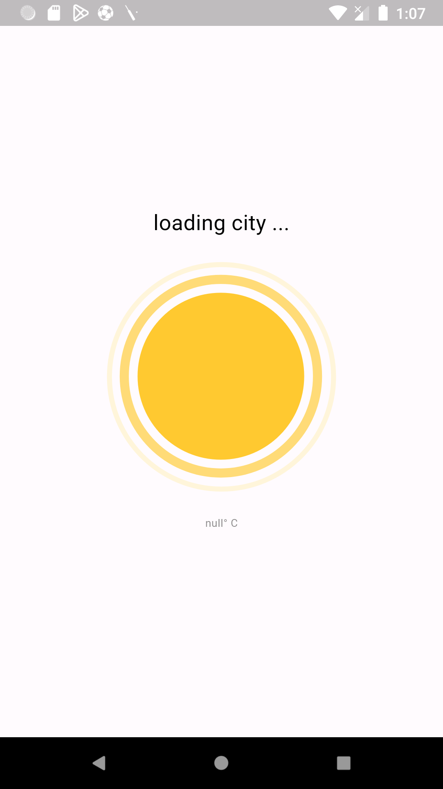
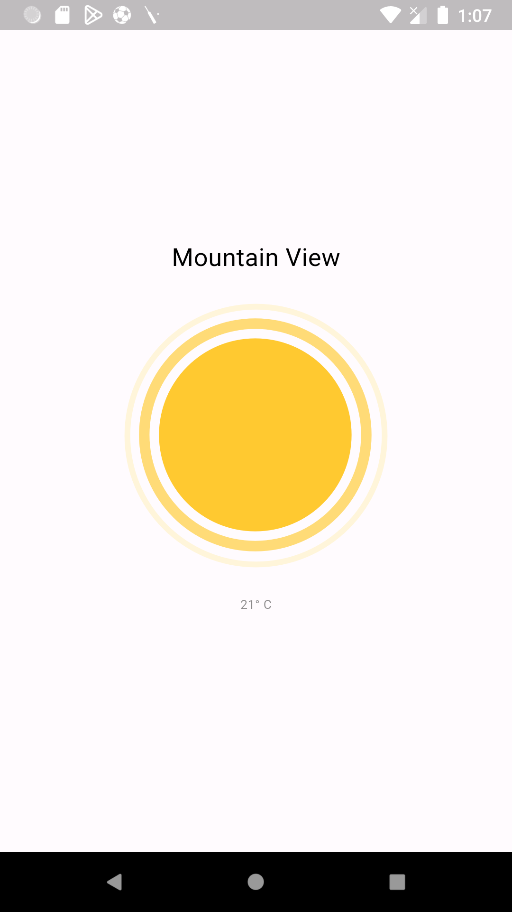

# flutter_minimalist_weatherapp

Created a Minimalistic WeatherApp using Flutter & Dart. 

The working is very simple, the app requests location permission from the user. Upon granting permission, the app detects the user's current location and displays the following information - 

> - **Current City Name:** The app displays the name of the city where the user is located.
> - **Weather Representation:** An image corresponding to the current weather conditions is shown.
> - **Average Temperature:** The average temperature of the user's city is displayed.

I am using the [Open Weather API](https://openweathermap.org/api) to fetch the weather details according to the location of the user.

## Screenshots -
 
